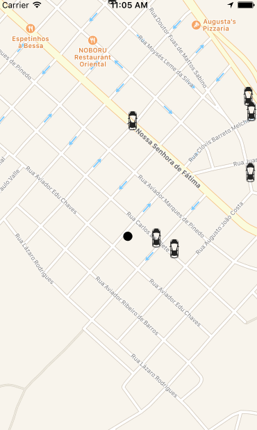

# uber-react
Uber-like project in React Native



# configuration

**File:** `.env`
Create a .env file with the following settings:

```
apiKey = "<firebase config>"
authDomain = "<firebase config>"
databaseURL = "<firebase config>"
storageBucket = "<firebase config>"
messagingSenderId = "<firebase config>"
mapBoxAccessToken = "<Access Token for MapBox Directions API>"
```

All these credentials you get from either Firebase or MapBox websites.

**File:** `fake_drivers/serviceAccountCredentials.json`

Get it from Firebase Service Accounts:

https://console.firebase.google.com/project/_/settings/serviceaccounts/adminsdk

# running
```
reaect-native run-ios
```

For the fake drivers:
```
cd fake_drivers
pip install -r requirements.txt
```

then

```
python fake_drivers.py <your latitude>,<your longitude>
```

***Do not forget to place the serviceAccountCredentials.json file in the same directory as described in the installation section***
